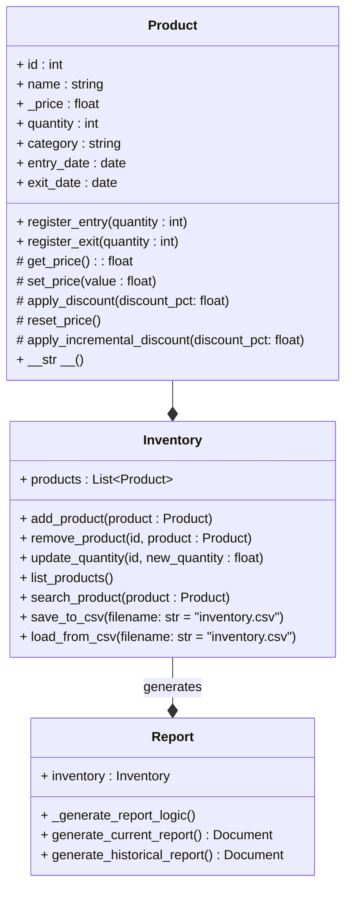

# 
 LogiStock- Warehouse Inventory System üìù 

## 
 ‚úß Team Rocket ‚úß 

<figure>  
<figcaption><b></b></figcaption></figure>

### Descripción

Sistema de gestión de inventarios con una interfaz gráfica intuitiva basada en Tkinter. Permite registrar productos con detalles como ID, nombre, precio, cantidad, categoría y fechas de entrada y salida. Además, facilita la actualización de existencias, búsqueda de productos, generación de reportes y almacenamiento seguro de datos mediante archivos CSV. Diseñado para optimizar la administración de inventarios en pequeños y medianos negocios, Inventrack combina funcionalidad y eficiencia, proporcionando un control preciso y automatizado del stock.

## Características
- Añadir y eliminar productos
- Visualizar el inventario
- Buscar productos mediante su ID
- Actualizar la cantidad
- Registrar la salida y entrada de productos
- Importar y modificar datos desde un archivo .csv

## Bibliotecas utilizadas
Todas las siguientes se encuentran incluidas en python 3.x
- Tkinter : se usa para la interfaz gráfica de usuario (GUI), permitiendo la gestión visual del inventario.
- CSV : Facilita la lectura y escritura de archivos CSV para guardar y cargar datos del inventario.
- OS : Permite interactuar con el sistema de archivos, verificando la existencia de archivos antes de cargarlos.
- Threading : Se emplea para la ejecución de procesos en segundo plano, evitando bloqueos en la interfaz de usuario.
- Datetime : Se usa para gestionar fechas de entrada y salida de productos en el inventario.
- Messagebox : Se usa para mostrar mensajes de información, advertencia o error en la interfaz gráfica.

## UML Class Diagram:

``` mermaid
classDiagram
    class Product {
        + id : int
        + name : string
        + _price : float
        + quantity : int
        + category : string
        + entry_date : date
        + exit_date : date
        + register_entry(quantity : int)
        + register_exit(quantity : int)
        # get_price() : float
        # set_price(value : float)
        # apply_discount(discount_pct: float)
        # reset_price()
        # apply_incremental_discount(discount_pct: float)
        + __str __()
    }

    class Inventory {
        + products : List~Product~ 
        + add_product(product : Product)
        + remove_product(id, product : Product)
        + update_quantity(id, new_quantity : float)
        + list_products()
        + search_product(product : Product)
        + save_to_csv(filename: str = "inventory.csv")
        + load_from_csv(filename: str = "inventory.csv")
    }

    class Report {
        + inventory : Inventory
        + _generate_report_logic()
        + generate_current_report() Document
        + generate_historical_report() Document
    }

    Product --* Inventory
    Inventory --* Report : generates
```

