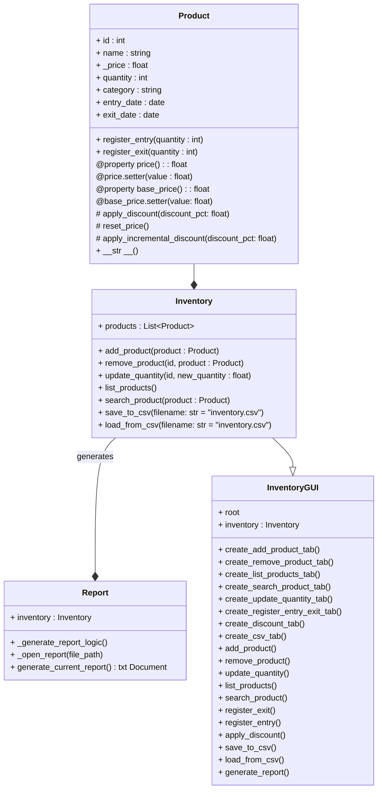

# <div align='center'> LogiStock- Warehouse Inventory System üìù </div>

## <div align='center'> ‚úß Team Rocket ‚úß </div>

<div align='center'> 
<figure> </br>
<figcaption><b></b></figcaption></figure>
</div>

## Descripción

Sistema de gestión de inventarios con una interfaz gráfica intuitiva basada en `Tkinter`. Permite registrar productos con detalles como ID, nombre, precio, cantidad, categoría y fechas de entrada y salida. Además, facilita la actualización de existencias, búsqueda de productos, generación de reportes y almacenamiento seguro de datos mediante archivos `CSV`. Diseñado para optimizar la administración de inventarios en pequeños y medianos negocios, Inventrack combina funcionalidad y eficiencia, proporcionando un control preciso y automatizado del stock.

## Características
- Añadir y eliminar productos.
- Visualizar el inventario.
- Buscar productos mediante su ID.
- Actualizar la cantidad.
- Registrar la salida y entrada de productos.
- Importar y modificar datos desde un archivo .csv.

## Bibliotecas utilizadas
Todas las siguientes se encuentran incluidas en `python 3.x`.
- Tkinter : se usa para la interfaz gráfica de usuario (GUI), permitiendo la gestión visual del inventario.
- CSV : Facilita la lectura y escritura de archivos CSV para guardar y cargar datos del inventario.
- OS : Permite interactuar con el sistema operativo, verificando la existencia de archivos antes de cargarlos.
- Threading : Se emplea para la ejecución de procesos en segundo plano, evitando bloqueos en la interfaz de usuario.
- Datetime : Se usa para gestionar fechas de entrada y salida de productos en el inventario.

## Diagrama de clases UML:

``` mermaid
classDiagram
    class Product {
        + id : int
        + name : string
        + _price : float
        + quantity : int
        + category : string
        + entry_date : date
        + exit_date : date
        + register_entry(quantity : int)
        + register_exit(quantity : int)
        @property price() : float
        @price.setter (value : float)
        @property base_price() : float
        @base_price.setter (value: float)
        # apply_discount(discount_pct: float)
        # reset_price()
        # apply_incremental_discount(discount_pct: float)
        + __str __()
    }

    class Inventory {
        + products : List~Product~ 
        + add_product(product : Product)
        + remove_product(id, product : Product)
        + update_quantity(id, new_quantity : float)
        + list_products()
        + search_product(product : Product)
        + save_to_csv(filename: str = "inventory.csv")
        + load_from_csv(filename: str = "inventory.csv")
    
    }
    class Report {
        + inventory : Inventory
        + _generate_report_logic()
        + _open_report(file_path)
        + generate_current_report() txt Document
        }

    class InventoryGUI {
        + root
        + inventory : Inventory
        + create_add_product_tab()
        + create_remove_product_tab()
        + create_list_products_tab()
        + create_search_product_tab()
        + create_update_quantity_tab()
        + create_register_entry_exit_tab()
        + create_discount_tab()
        + create_csv_tab()
        + add_product()
        + remove_product()
        + update_quantity()
        + list_products()
        + search_product()
        + register_exit()
        + register_entry()
        + apply_discount()
        + save_to_csv()
        + load_from_csv()
        + generate_report()
        }

    Product --* Inventory
    Inventory --* Report : generates
    Inventory --|> InventoryGUI
```

## üìå Requerimientos

- **Python 3.6+**
- **Tkinter** (incluido con Python)
- Librerías estándar: `csv`, `os`, `threading`, `datetime`

---

# Creación de Entorno Virtual e instalación

## 🐧 Método para Linux/Mac
Ejecuta el siguiente comando en la terminal para clonar el repo
```bash
git clone https://github.com/lucholopez1/LogiStock-
cd LogiStock-
```
Ahora ejecuta el siguiente comando para crear y activar el entorno virtual:

```bash
bash setup_environment.sh
```

## 🖥️ Método para Windows
Si usas Windows,
Abrir la terminal y navegar hasta la ubicación de descarga de la carpeta del proyecto, por ejemplo:
cd C:\Users\User\Documents\LogiStock

Sigue estos pasos en la terminal (cmd o PowerShell):

### 1. Crear el entorno virtual:
```bash
python -m venv venv
```
### 2. Activarlo:

Para CMD:

```bash
venv\Scripts\activate.bat
```

Para PowerShell (debes permitir scripts con Set-ExecutionPolicy Unrestricted -Scope Process si es necesario):
```bash
venv\Scripts\Activate.ps1
```
### 3. Actualizar pip (opcional pero recomendado):
```bash
python -m pip install --upgrade pip
```

### 4. Para ejecutar el programa

```bash
python main.py
```

*Juan Rodríguez - Luis López - Nicolas Estupiñan*
